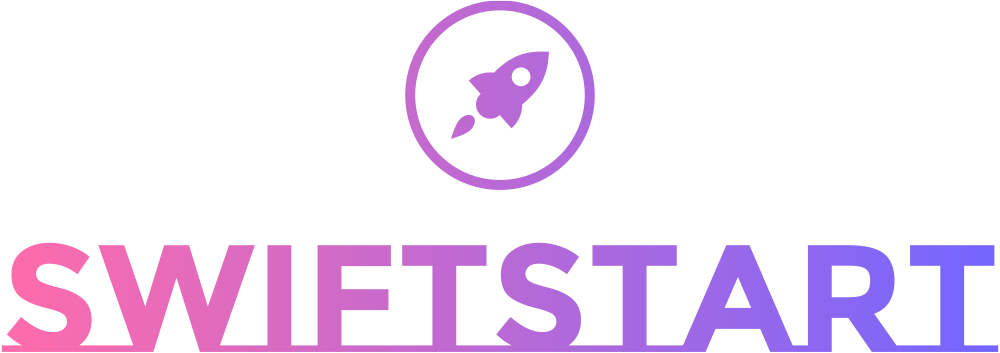

<div align="center"><a href="https://github.com/devbytemehedi/swiftstart.git"></a>
 <h3><strong>A versatile web project starter template with HTML5, CSS3, Tailwind CSS, daisyUI, Git, and Node.js for quick, responsive web development.</strong></h3>
<a href="https://devbytemehedi.github.io/swiftstart"> </a></div>

## How to run this ?

1. **Clone this repo**

```bash
git clone https://github.com/devbytemehedi/swiftstart.git
```

2. **Open swiftstart in vscode**

```pwsh
code swiftstart
```

3. **Install node modules**

```bash
npm i
```

4. **Build the** `style.css` **file**

```bash
npm run build
```

5. **Install Live Server Extension**
6. **Open index.html and Right click on the editor**
7. **Click "Open with Live Server".**
8. **Project should be up and running in your browser.**

## OS, Terminal & Shell

  

## Software Used

   

## Technology Used

      

## Connect with me

[](https://facebook.com/iamrealmehedi) [](http://instagram.com/iamrealmehedi)
[](https://github.com/devbytemehedi) [](https://www.linkedin.com/in/devbytemehedi/) [](https://dev.to/devbytemehedi)

## Folder Structure

```css
swiftstart
 ┣ .vscode
 ┃ ┗ settings.json
 ┣ src
 ┃ ┣ assets
 ┃ ┃ ┣ favicons
 ┃ ┃ ┃ ┣ icon.png
 ┃ ┃ ┃ ┗ icon.svg
 ┃ ┃ ┣ icons
 ┃ ┃ ┃ ┣ dev.svg
 ┃ ┃ ┃ ┣ facebook.svg
 ┃ ┃ ┃ ┣ github.svg
 ┃ ┃ ┃ ┣ instagram.svg
 ┃ ┃ ┃ ┗ linkedin.svg
 ┃ ┃ ┗ logo
 ┃ ┃ ┃ ┣ logo-black.png
 ┃ ┃ ┃ ┣ logo-color.png
 ┃ ┃ ┃ ┣ logo-no-bg.png
 ┃ ┃ ┃ ┗ logo-white.png
 ┃ ┣ 404.html
 ┃ ┣ index.html
 ┃ ┣ input.css
 ┃ ┗ main.js
 ┣ .gitattributes
 ┣ .gitignore
 ┣ LICENSE
 ┣ package.json
 ┣ README.md
 ┣ robots.txt
 ┗ tailwind.config.js


```

## License

The code is available under the [MIT](./LICENSE) license.

## Acknowledgements

This project uses the following free resources:

- [Logo.com](https://logo.com/) - A free online logo maker and branding tool.
- [Favicon.io](https://favicon.io/) - A website that provides tools for creating favicons, which are small icons that appear in the address bar or tab of a web browser.
- [Icons8](https://icons8.com/) - A website that provides a large collection of free icons, photos, vectors, and music.
- [HTML5 Boilerplate](https://html5boilerplate.com/) - A professional front-end template for building fast, robust, and adaptable web apps or sites.
- [Tailwind Playlist by Learn with Sumit](https://github.com/learnwithsumit/tailwind-playlist/tree/lesson-2) - A repository containing lessons on using Tailwind CSS.

Thank you to the creators of these resources for making them available for free!
